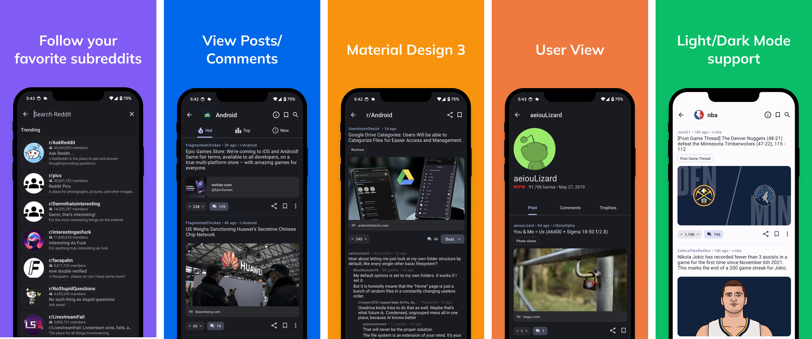

# Dreddit

An open-souce, Reddit client written in React-Native, using Material Design 3.



## Description

### Functionality

- search list of subreddits
- view posts in a given subreddit (choice of hot/new/top)
- view comments from a post
- automatically parse post links to display the image/video inside the app
- bookmark subreddits
- save posts
- search user/posts
- search posts inside a subreddit
- view user profile

### What this client cannot do

The API only works as a read-only API, so you

- can't comment
- can't mod
- can't post

## Installation/Build

Run

```
npm install
```

to install all the dependencies.

Then run

```
npm run ios
```

or

```
npm run android
```

to launch the project

### Dependencies

This project is build using Expo SDK, and has been tested with Expo 51.

- JAVA version for Android build: 17 (required by @pchmn/expo-material3-theme package)

## Disclaimer

This project is an **open-source** software with the [MIT License](https://github.com/tictechtown/dreddit/blob/main/LICENSE). The projects is nothing more than a simple example of how to use Reddit's RSS/JSON feeds to build a read-only Reddit client, and it is not intended to be used as a Reddit client. Instead, use the official Reddit app or any other Reddit client that uses Reddit's API for full functionality. **No data is collected** from the users and **no profit is made** from the app. Developers are not responsible for any damage caused by the app. **Use at your own risk.**
